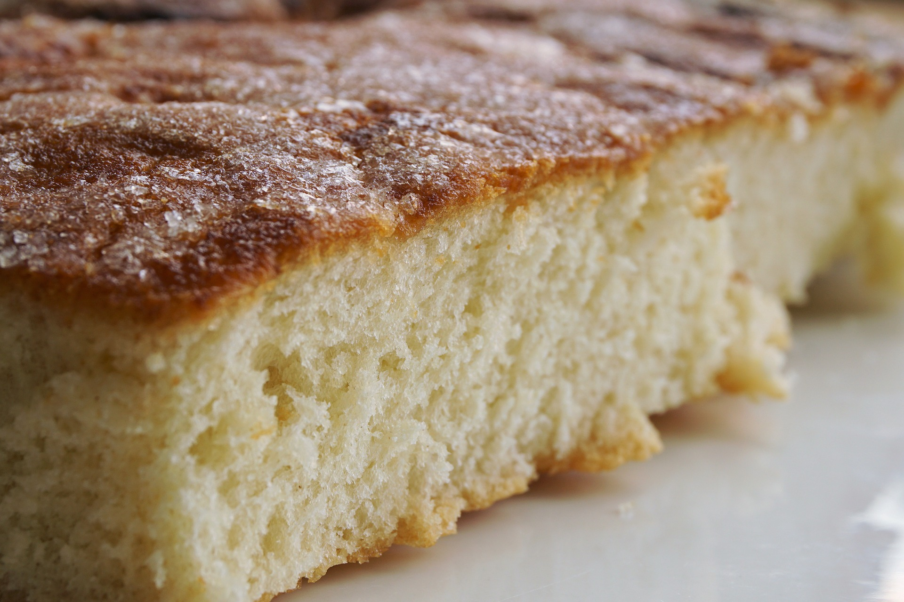

# F1: Kodexempel 2

```html
<!DOCTYPE html>
<html lang="sv">
  <head>
    <meta charset="utf-8">
    <title>Recept på sockerkaka</title>
  </head>
  <body>
    <h1>Sockerkaka</h1>

    <!--
      I stycket nedan har vi lagt till en hyperlänk för att hänvisa till källan. För att skapa hyperlänkar använder vi <a> (anchor). <a>-elementet tar ett attribut som heter `href` (hypertext reference). Värdet på attributet är URL:en som länken ska gå till.
      Med attributet `target` styr vi var sidan öppnas. Värdet `_blank` innebär att den öppnas i en ny flik/fönster.
    -->
    <p>
      Sockerkaka är mumma!
      Det här receptet är skapat av <a href="http://www.leila.se/sockerkaka/recept/bakverk/index1,23.htm?id=3446" target="_blank">Leila</a>.
    </p>
    <!--
      URL:er kan innehålla ett fragment, dvs en del som börjar med ett nummertecken (#). Webbläsaren kommer leta efter ett element med det id:t och skrolla dit.
    -->
    <p>
      <a href="#ingredienser">Gå direkt till receptet</a>
    </p>

    <!--
      Bädda in en bild med -elementet. Ange sökvägen till bilden med `src`-attributet.
      Du bör även alltid ange en alternativ text som används av skärmläsare och sökmotorer. Det gör du med `alt`-attributet.
      Om du vet hur stor bilden är det också bra att ange både bredd och höjd. Använd `width` och `height`. Värdena är i pixlar.
      Med `width` och `height` kan du också styra storleken på bilden. Om du bara anger den ena dimensionen kommer den andra räknas ut så att bilden skalas proportionerligt. Om du anger båda är det upp till dig att ange proportionerliga värden.
      Du kan också ange bredd och höjd i procent. Det är då i förhållande till det omsultande elementets storlek. Observera att element normalt inte har någon höjd så `height="100%"` gör kanske inte det du tror...
    -->
    

    <!--
      Alla HTML-element kan ha ett `id`-attribut. Det ska vara unikt för dokumentet. Man kan länka direkt till dessa element med ett fragment i webbadressen.
    -->
    <h2 id="ingredienser">Du behöver:</h2>
    <!--
      En lista med ingredienser passar bäst som onumrerad. Vi använder <ul> (unordered list) för att skapa en sådan. Varje punkt blir ett <li>-element.
    -->
    <ul>
      <li>3 ekologiska ägg</li>
      <li>2 1/2 dl strösocker</li>
      <li>1 tsk vaniljsocker</li>
      <li>50 g smör</li>
      <li>1 dl mjölk</li>
      <li>3 1/2 dl vetemjöl</li>
      <li>2 tsk bakpulver</li>
      <li>1 nypa salt</li>
      <li>Smör och ströbröd till formen</li>
    </ul>

    <h2 id="instruktioner">Gör så här:</h2>
    <!--
      Stegen i receptet passar bättre som en numrerad lista. Vi använder <ol> (ordered list) istället för <ul>, men punkterna är fortfarande <li>-element.
    -->
    <ol>
      <li>Sätt ugnen på 175 grader.</li>
      <li>Vispa ägg, strösocker och vaniljsocker vitt och riktigt pösigt.</li>
      <li>Smält smöret och rör i mjölken, blanda det med äggsmeten.</li>
      <li>Blanda vetemjöl, bakpulver och salt och vänd försiktigt ner det i smeten.</li>
      <li>Välj smaksättning eller fyll en smord och bröad sockerkaksform.</li>
      <li>Grädda kakan i mitten av ugnen i 25–30 minuter. Prova med en sticka, den ska inte vara kladdig.</li>
      <li>Låt sockerkakan svalna något och stjälp sedan upp den på ett brödgaller.</li>
    </ol>
  </body>
</html>
```
